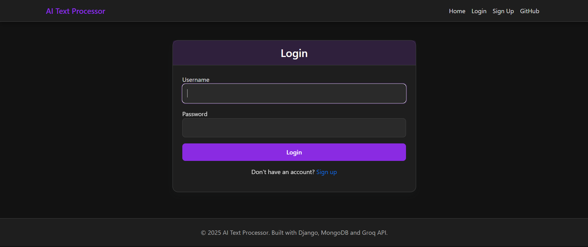
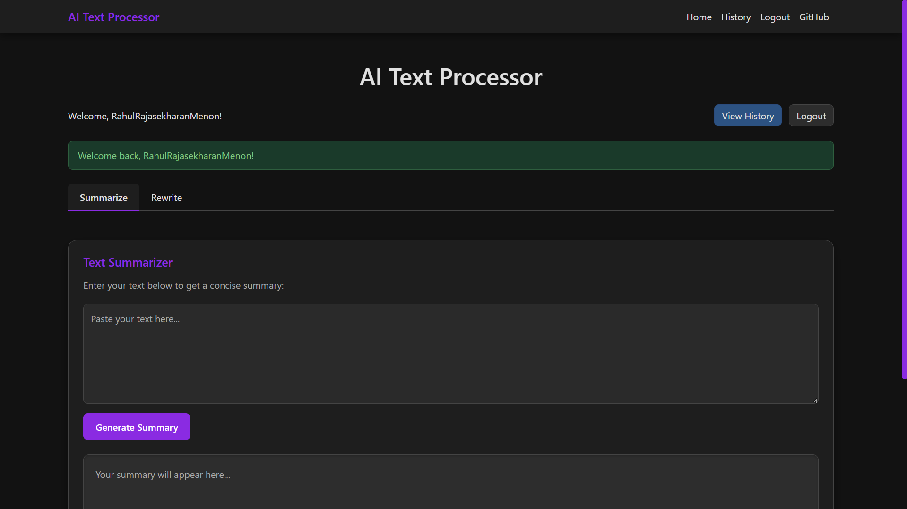
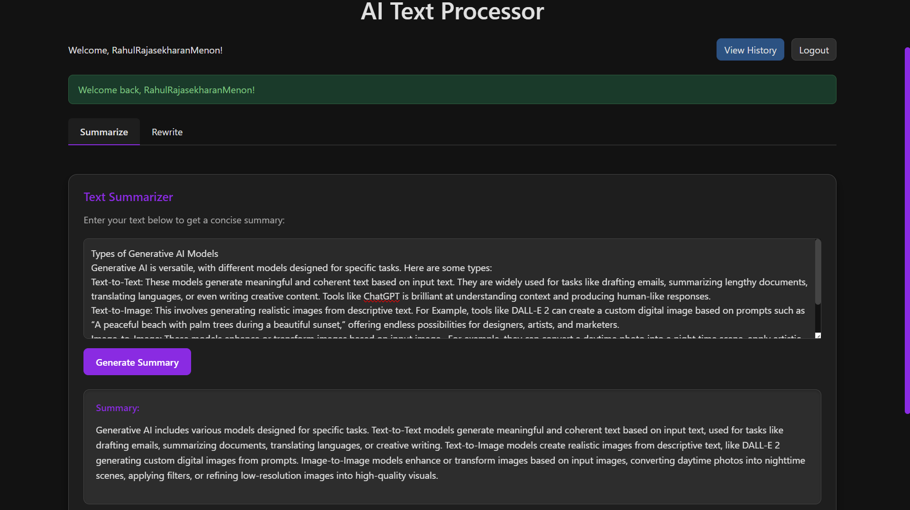
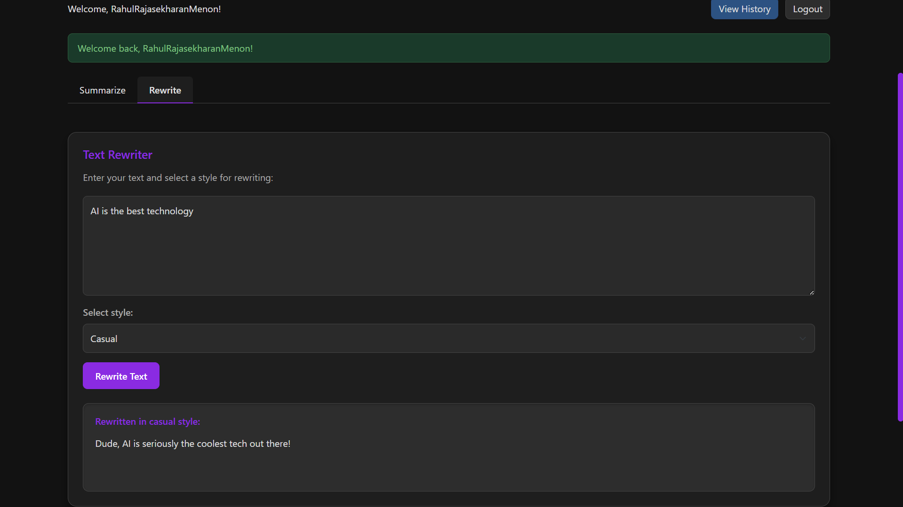
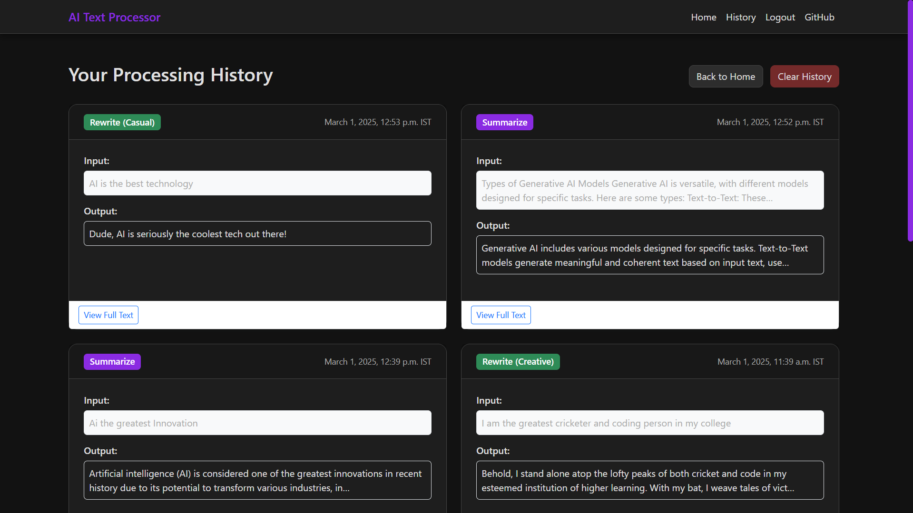

# AI Text Processor

A Django-based web application that uses the Groq API to provide text summarization and style-based text rewriting capabilities. Features user authentication and history tracking.

## Features

- **Text Summarization**: Condense long texts into concise summaries
- **Text Rewriting**: Rewrite content in different styles:
  - Casual
  - Formal
  - Creative
- **User Authentication**: 
  - Secure signup and login
  - User-specific processing history
- **History Tracking**:
  - View all your past text processing operations
  - Clear history functionality
- **Modern UI**: Responsive dark-themed interface
- **Real-time Processing**: Asynchronous API calls with loading indicators

## Screenshots







## Technologies Used

- **Backend**: Django 5.1.6, Django REST Framework
- **Frontend**: HTML5, CSS3, JavaScript, Bootstrap 5
- **Database**: MongoDB
- **Authentication**: Django Authentication System
- **API Integration**: Groq API (using the Mixtral 8x7b model)
- **Development**: Python 3.11+

## Prerequisites

Before you begin, ensure you have the following installed:
- Python 3.11 or higher
- pip (Python package manager)
- A Groq API key

## Installation

1. Clone the repository:
   ```bash
   git clone https://github.com/RahulRmCoder/AI-Text-Processing-Application.git
   cd AI-Text-Processing-Application
   ```

2. Create and activate a virtual environment:
   ```bash
   python -m venv venv
   
   # On Windows
   .\venv\Scripts\activate
   
   # On macOS/Linux
   source venv/bin/activate
   ```

3. Install the required packages:
   ```bash
   pip install -r requirements.txt
   ```

4. Create a `.env` file in the root directory and add your Groq API key:
   ```
   GROQ_API_KEY=your_api_key_here
   ```

5. Apply migrations:
   ```bash
   python manage.py migrate
   ```

## Running the Application

1. Start the development server:
   ```bash
   python manage.py runserver
   ```

2. Open your browser and navigate to:
   ```
   http://127.0.0.1:8000/
   ```

3. Create an account or login to access all features.

## Project Structure

## Project Structure

```
ai_summarizer/
├── ai_summarizer/         # Main project settings
│   ├── __init__.py
│   ├── asgi.py
│   ├── settings.py
│   ├── urls.py
│   └── wsgi.py
├── summarizer/            # App directory
│   ├── __init__.py
│   ├── admin.py
│   ├── apps.py
│   ├── forms.py           # Form definitions for web UI
│   ├── migrations/
│   ├── models.py          # Data models including ChatHistory
│   ├── serializers.py     # DRF serializers
|   ├── services.py
│   ├── templates/         # HTML templates
│   │   ├── summarizer/    # App-specific templates
│   │   │   ├── index.html     # Main app template
│   │   │   ├── login.html     # Authentication templates
│   │   │   ├── signup.html
│   │   │   └── history.html   # User history page
|   |   └── base.html      # Base template with dark theme
│   ├── tests.py
│   ├── urls.py            # App URL configurations
│   └── views.py           # API and view controllers         
├── .env                   # Environment variables (not tracked in git)
├── .gitignore
├── manage.py
```

## API Endpoints

### Summarize Text
- **URL**: `/api/summarize/`
- **Method**: POST
- **Request Body**:
  ```json
  {
    "text": "Your long text to summarize here..."
  }
  ```
- **Response**:
  ```json
  {
    "summary": "Summarized version of the text..."
  }
  ```

### Rewrite Text
- **URL**: `/api/rewrite/`
- **Method**: POST
- **Request Body**:
  ```json
  {
    "text": "Your text to rewrite here...",
    "style": "casual|formal|creative"
  }
  ```
- **Response**:
  ```json
  {
    "rewritten_text": "The rewritten text in the specified style..."
  }
  ```

### User History
- **URL**: `/api/history/`
- **Method**: GET
- **Authentication**: Required
- **Response**: List of user's processing history entries

## Web Interface Routes

- **Home**: `/` - Main text processing interface
- **Login**: `/login/` - User login page
- **Signup**: `/signup/` - New user registration
- **History**: `/history/` - View processing history (requires login)
- **Logout**: `/logout/` - Log out current user

## Customization

### Modifying the Theme
- Edit the CSS in the `<style>` section of the `base.html` file to customize the appearance
- The application uses a dark theme by default, but this can be changed

### Adding New Rewriting Styles
1. Update the `index.html` template to include new options in the style selector
2. Modify the `RewriteSerializer` in `serializers.py` to validate the new styles
3. Test with the Groq API to ensure it can handle the new style requests

### Timezone Settings
- The application displays timestamps in your local timezone
- You can modify the timezone in `settings.py` using the `TIME_ZONE` setting

## Deployment

For production deployment:
1. Set `DEBUG = False` in `settings.py`
2. Configure a production-ready web server (e.g., Nginx, Apache)
3. Use a WSGI server like Gunicorn
4. Ensure your `.env` file with the API key is securely set up
5. Consider using HTTPS for secure API communication
6. For production, consider using a more robust database like PostgreSQL

## Contributing

1. Fork the repository
2. Create your feature branch (`git checkout -b feature/amazing-feature`)
3. Commit your changes (`git commit -m 'Add some amazing feature'`)
4. Push to the branch (`git push origin feature/amazing-feature`)
5. Open a Pull Request

## License

This project is licensed under the MIT License - see the LICENSE file for details.

## Acknowledgements

- [Django](https://www.djangoproject.com/)
- [Django REST Framework](https://www.django-rest-framework.org/)
- [Bootstrap](https://getbootstrap.com/)
- [Groq API](https://console.groq.com/)
